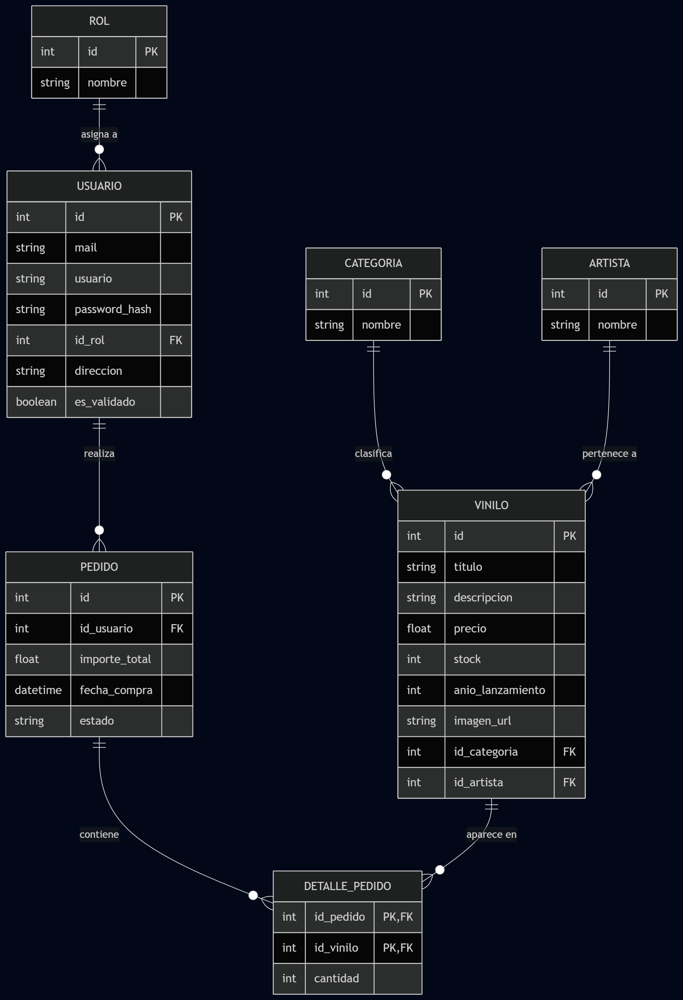

Trabajo fin de grado de David Hernández Carmona para 2º de Desarrollo de Aplicaciones Web. Consiste en una web de venta de vinilos.

## Índice

- [Diagrama Entidad-Relación](#diagrama-entidad-relación)
- [Backend](#backend)

---

### Diagrama Entidad-Relación

Diagrama de la base de datos diseñado con **Mermaid**.

---

### Backend 

El backend está desarrollado con **NestJS** como framework, **Prisma ORM** como ORM y una base de datos **PostgreSQL**. Se podrá consultar la base de datos utilizando prisma studio con el comando `npx prisma studio`.