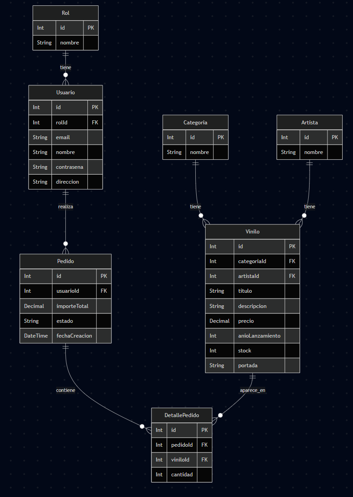
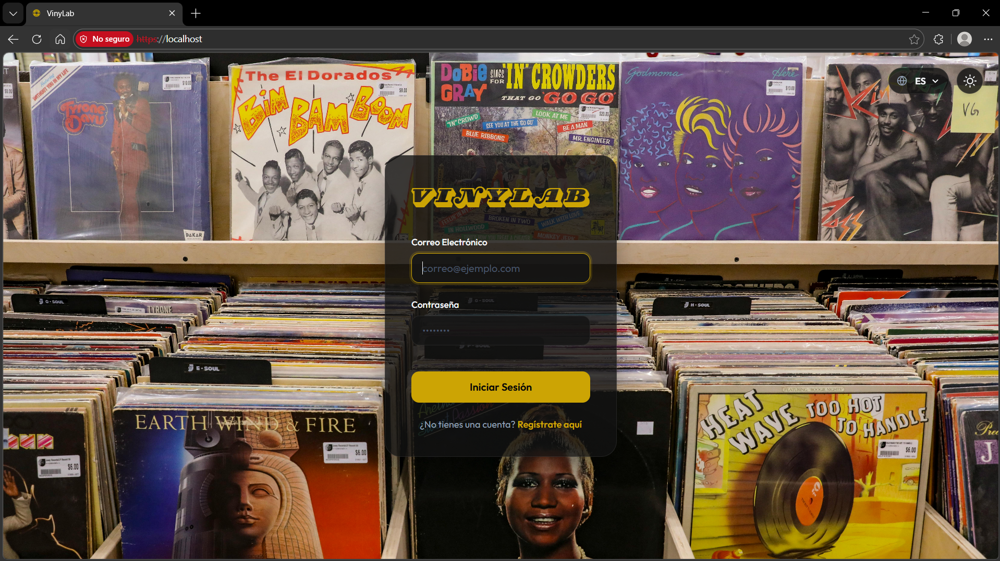
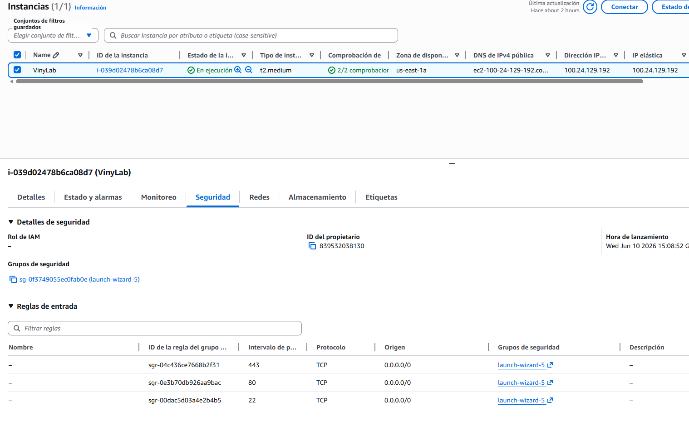
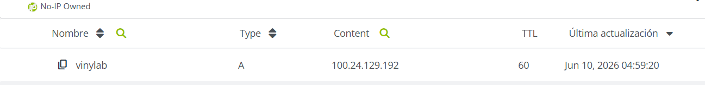
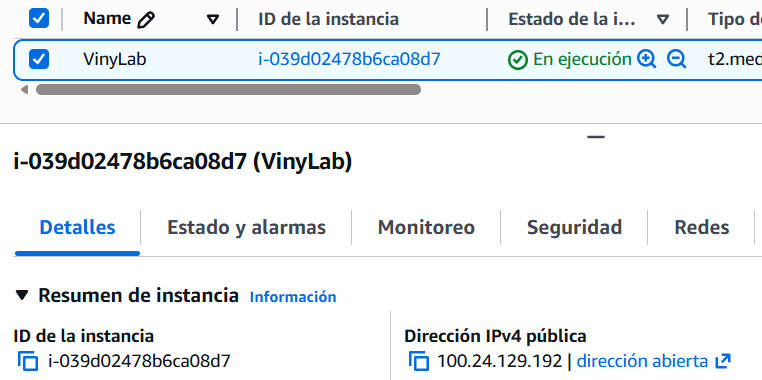
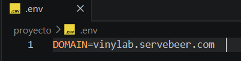

Trabajo fin de grado de David Hernández Carmona para 2º de Desarrollo de Aplicaciones Web. Consiste en una web de venta de vinilos.

### <a id="indice"></a>Índice

- [Diagrama Entidad-Relación](#diagrama-entidad-relacion)
- [Backend](#backend)
  - [Arquitectura y estructura del código](#arquitectura-y-estructura-del-backend)
  - [Prisma](#prisma)
  - [Librerías implementadas](#librerias-implementadas-en-el-backend)
  - [Diseño del backend](#diseno-del-backend)
- [Frontend](#frontend)
  - [Arquitectura y estructura del código](#arquitectura-y-estructura-del-frontend)
  - [Comandos del frontend](#comandos-del-frontend)
  - [Librerías implementadas](#librerias-implementadas-en-el-frontend)
  - [Diseño del frontend](#diseno-del-frontend)
- [Despliegue](#despliegue)
  - [Docker Hub](#docker-hub)
  - [Ejecución local](#ejecucion-local)
  - [Despliegue en producción](#despliegue-en-produccion)
- [Manual de usuario](#manual-de-usuario)
  - [Login y registro](#login-y-registro)
  - [Panel de administrador](#panel-de-administrador)
  - [Catálogo](#catalogo)

---

### <a id="diagrama-entidad-relacion"></a>Diagrama Entidad-Relación

Diagrama de la base de datos diseñado con **Mermaid**.



[↑ Volver arriba ↑](#indice)
---

### <a id="backend"></a>Backend

El backend está desarrollado con el framework **NestJS**, **Prisma ORM** como ORM y una base de datos **PostgreSQL**. A continuación se detallan las decisiones de arquitectura, comandos utilizados y librerías clave implementadas.


#### <a id="arquitectura-y-estructura-del-backend"></a>1. Estructura

NestJS promueve una arquitectura modular limpia orientada al mantenimiento de código a gran escala. Para organizar el proyecto de forma desacoplada y reutilizable, se utilizaron comandos de generación automáticos del CLI de NestJS:

- **Inicialización:**
  ```bash
  nest new vinylab_backend
  ```
  Crea la base estándar del framework con inyección de dependencias y pruebas unitarias.

- **Generación de módulos:**
  ```bash
  nest g res <nombre_recurso>
  ```
  Usado para generar los módulos de: `artista`, `categoria`, `vinilo`, `usuario`, `rol`, y `pedido`. Este comando genera todo el esqueleto necesario bajo el patrón modular de NestJS:

  - **Controladores:** Manejan las peticiones HTTP externas y asocian las rutas.
  - **Servicios:** Albergan la lógica de la API y llamadas al ORM.
  - **Módulos:** Encapsulan y exponen los controladores y servicios relacionados.
  - **DTOs:** Definen el tipado de los datos de entrada/salida y sus validaciones.


#### <a id="prisma"></a>2. Prisma
  - `npx prisma init`: Crea la carpeta de Prisma y el archivo de configuración `.env` inicial.
  - `npx prisma migrate dev --name init_vinylab`: Aplica cambios en la base de datos de PostgreSQL, generando los archivos de migración `.sql`.
  - `npx prisma generate`: Genera el código interno de TypeScript del cliente de Prisma, adaptado al esquema.
  - `npx prisma db seed`: Ejecuta el script `prisma/seed.js`, que limpia las tablas y recrea datos iniciales como son roles, usuarios administrador y cliente predeterminados, categorías musicales, artistas y vinilos con imágenes y datos completos.
  - `npx prisma studio`: Arranca un panel visual de administración en local para consultar, crear y modificar datos manualmente de forma ágil.


#### <a id="librerias-implementadas-en-el-backend"></a>3. Librerías implementadas

* **`@nestjs/common`, `@nestjs/core`, `@nestjs/platform-express`**: El núcleo del framework. Gestiona la inyección de dependencias, el enrutamiento REST y el servidor Express subyacente.
* **`@nestjs/config`**: Facilita la inyección de las variables de entorno definidas en `.env`.
* **`@nestjs/jwt`, `@nestjs/passport`, `passport`, `passport-jwt`**: Implementan el sistema de seguridad y autenticación. Generan y validan tokens JWT firmados digitalmente.
* **`bcrypt`**: Permite almacenar contraseñas de forma segura, evitando almacenar contraseñas en texto plano mediante funciones hash.
* **`class-validator` y `class-transformer`**: Validan de forma estricta los cuerpos de las peticiones mediante decoradores, como `@IsString()`, `@IsEmail()`, `@IsNotEmpty()` en los DTOs.
* **`@prisma/client` & `@prisma/adapter-pg`**: Habilitan la comunicación directa de Prisma con PostgreSQL.
* **`@nestjs/mapped-types`**: Permite reutilizar tipos de DTOs, reduciendo la duplicación de código.

#### <a id="diseno-del-backend"></a>4. Otras consideraciones

- **Guards:**
  - `JwtAuthGuard`: Protege todas las rutas por defecto y requiere un token JWT válido, exceptuando las rutas decoradas con `@Public()`.
  - `RolesGuard`: Comprueba si el usuario tiene el rol requerido (`Cliente` o `Admin`), indicado por el decorador `@Roles(...)`.
- **Validación**
  El servidor utiliza un `ValidationPipe` global con:
  - `whitelist: true`: Elimina cualquier campo sobrante que no esté definido en el DTO.
  - `transform: true`: Convierte los parámetros de ruta y cuerpos de petición a sus tipos nativos correspondientes. Por ejemplo, strings de ID a enteros.
- **Límites de Carga:**
  Se incrementó la capacidad máxima de recepción de peticiones HTTP en `main.ts` a `10mb` para permitir el almacenamiento de portadas en formato base64 ya que el tamaño máximo por defecto es 1mb, no permite subir imágenes de mayor tamaño y puede dar errores o no visualizarse la imagen correctamente.
- **Servicio Estático e Integración Single-Page Application (SPA):**
  Si el compilado de producción del frontend se encuentra disponible en la carpeta `public`, el backend lo sirve de forma directa y redirige cualquier ruta del navegador que no preocupe a la API hacia `index.html`.

#### 5. Comandos para el inicio

- **`npm run build`**: Compila la aplicación.
- **`npm run start:dev`**: Inicia el backend en modo desarrollo con refresco automático de la página web en el navegador al guardar cambios en el código.

[↑ Volver arriba ↑](#indice)
---

### <a id="frontend"></a>Frontend

El frontend está desarrollado con la biblioteca **React** y el empaquetador **Vite**. Para los estilos se utiliza **CSS Vanilla** y para la gestión de rutas **React Router DOM**.


#### <a id="arquitectura-y-estructura-del-frontend"></a>1. Estructura

La interfaz de usuario se construye bajo un diseño modular orientado a componentes, separando claramente las responsabilidades del panel de control de administración y de la tienda interactiva del cliente:

- **Inicialización:**
  ```bash
  npm create vite@latest vinylab_frontend -- --template react
  ```
  Genera la estructura inicia del proyecto utilizando React.

- **Estructura:**
  Organizado dentro de **`components/`:** 
    - **`admin/`:** Componentes específicos para el panel de administración:
      - [TablaCrud.jsx](./vinylab_frontend/src/components/admin/TablaCrud.jsx)
      - [ModalCrud.jsx](./vinylab_frontend/src/components/admin/ModalCrud.jsx)
      - [TablaDatosCrud.jsx](./vinylab_frontend/src/components/admin/TablaDatosCrud.jsx)
      - [SubirImagen.jsx](./vinylab_frontend/src/components/admin/SubirImagen.jsx) (conversión y validación de imágenes a base64)
    - **`tienda/`:** Componentes de la tienda de cara al cliente:
      - [BarraFiltros.jsx](./vinylab_frontend/src/components/tienda/BarraFiltros.jsx)
      - [Carrito.jsx](./vinylab_frontend/src/components/tienda/Carrito.jsx)
      - [ModalPago.jsx](./vinylab_frontend/src/components/tienda/ModalPago.jsx)
      - [ModalDetallesVinilo.jsx](./vinylab_frontend/src/components/tienda/ModalDetallesVinilo.jsx)
    - **Componentes raíz:**
      - [Auth.jsx](./vinylab_frontend/src/components/Auth.jsx) (Acceso/Registro)
      - [Tienda.jsx](./vinylab_frontend/src/components/Tienda.jsx) (Catálogo)
      - [PanelControl.jsx](./vinylab_frontend/src/components/PanelControl.jsx) (Panel de Administración)
    - **`styles/`:** Archivos CSS organizados modularmente en `base.css`, `variables.css`, y las subcarpetas `store` and `admin`
      para evitar hojas de estilo muy extensas. Se ha añadido modo día/noche y usado el formato de clases como bootstrap para hacer más fácil y cómodo el diseño.
    - **`utils/`:** Clases y funciones transversales:
    - [api.js](./vinylab_frontend/src/utils/api.js): Automatiza el envío del token de sesión JWT en las cabeceras.
    - [LanguageContext.jsx](./vinylab_frontend/src/utils/LanguageContext.jsx): las traducciones español e ingles.


#### <a id="comandos-del-frontend"></a>2. Comandos

- `npm install <librería>`: Instala todas las dependencias especificadas en el archivo `package.json`.
- `npm run dev`: Arranca el servidor local de desarrollo con Vite (por defecto en `http://localhost:5173`) habilitando Hot Module Replacement (HMR) para reflejar cambios en caliente.
- `npm run build`: Compila la aplicación.

#### <a id="librerias-implementadas-en-el-frontend"></a>3. Librerías implementadas

* **`react` & `react-dom`**: El motor de la interfaz, encargado de la renderización eficiente de componentes mediante el DOM.
* **`react-router-dom`**: Maneja el enrutamiento, permitiendo transiciones dinámicas entre la Tienda, el Panel de Administración y el Login sin recargar la página.


#### <a id="diseno-del-frontend"></a>4. Otras consideraciones

- **Rutas Protegidas e Inyección de Sesión:**
  - El componente `RutaProtegida` intercepta el acceso a las vistas de la aplicación y valida el token JWT.
- **Modo día/noche:**
  - Administrado en el componente principal `App.jsx` mediante un estado sincronizado con el `localStorage`. Al cambiar el tema, se añade o elimina la clase `.light-mode` del cuerpo (`<body>`) del documento HTML.
- **Traducción:**
  - Mediante la función `t()`, traduce dinámicamente textos y notificaciones, guardando la preferencia del usuario en el almacenamiento local.
- **Sincronización en Tiempo Real:**
  - Las tablas de administración (`TablaCrud`) instancian la conexión `EventSource` con el backend. Esto permite actualizar en tiempo real el catálogo de vinilos, la lista de usuarios y el historial de pedidos ante cualquier inserción, modificación o borrado que ocurra en el servidor.
- **Gestión del carrito y Pasarela de pago simulada:**
  - El carrito calcula subtotales, totales y previene que el usuario añada más discos de los disponibles en el stock en tiempo real. La pasarela de pago (`ModalPago`) valida el formato de los datos de la tarjeta mediante expresiones regulares antes de realizar un pedido simulado y enviarlo al backend.
- **Codificación de imágenes en base64:**
  - El componente `SubirImagen` lee las imágenes usando `FileReader` y las convierte a texto base64. De este modo, las imágenes se envían en el cuerpo del JSON directamente a la base de datos de PostgreSQL.

[↑ Volver arriba ↑](#indice)
---
### <a id="despliegue"></a>Despliegue


#### <a id="docker-hub"></a>1. Docker Hub
El código íntegro de la aplicación se almacena y se despliega automáticamente en Docker Hub en la imagen `davidhc19/vinylab:latest` cada vez que se actualiza el repositorio de GitHub con el workflow `deploy.yml` a través de GitHub Actions:

```yaml
name: Construir y subir imágenes a Docker Hub

on:
  push:
    branches:
      - main
      - master

jobs:
  build-and-push:
    runs-on: ubuntu-latest

    steps:
      - name: Revisar código
        uses: actions/checkout@v4

      - name: Iniciar sesión en Docker Hub
        uses: docker/login-action@v3
        with:
          username: ${{ secrets.DOCKER_USERNAME }}
          password: ${{ secrets.DOCKER_PASSWORD }}

      - name: Configurar Buildx
        uses: docker/setup-buildx-action@v3

      - name: Construir y subir imagen conjunta
        uses: docker/build-push-action@v5
        with:
          context: .
          push: true
          tags: ${{ secrets.DOCKER_USERNAME }}/vinylab:latest
```

#### <a id="ejecucion-local"></a>2. Ejecución local

Podemos descargar la imagen ([davidhc19/vinylab:latest](https://hub.docker.com/r/davidhc19/vinylab/tags)) desde cualquier ubicación y ejecutar la aplicación con el siguiente `docker-compose.yml`, que arranca la base de datos, la aplicación principal y el servicio https-portal con un certificado SSL autofirmado: 

```yaml
services:
  db:
    image: postgres:15-alpine
    container_name: vinylab-db
    restart: always
    environment:
      POSTGRES_USER: postgres
      POSTGRES_PASSWORD: postgres
      POSTGRES_DB: vinylab
    ports:
      - "5432:5432"
    volumes:
      - postgres_data:/var/lib/postgresql/data
    healthcheck:
      test: ["CMD-SHELL", "pg_isready -U postgres -d vinylab"]
      interval: 5s
      timeout: 5s
      retries: 5
      start_period: 5s
  app:
    image: davidhc19/vinylab:latest
    container_name: vinylab-app
    restart: always
    depends_on:
      db:
        condition: service_healthy
    environment:
      PORT: 3000
      DATABASE_URL: postgresql://postgres:postgres@db:5432/vinylab?schema=public
      JWT_SECRET: vinylab_secret_key_super_secure_2026

  https-portal:
    image: steveltn/https-portal:1
    ports:
      - 80:80
      - 443:443
    environment:
      #DOMAINS: "${DOMAIN} -> http://app:3000 #production"
      DOMAINS: 'localhost -> http://app:3000 #local'      
    volumes:
      - ssl_certs_data:/var/lib/https-portal
    depends_on:
      - app
    restart: always

volumes:
  postgres_data:
  ssl_certs_data:
```

Para arrancar la aplicación, ejecutar en el terminal:

```bash
docker-compose up
```

Se verá el resultado en [localhost:80](http://localhost):



#### <a id="despliegue-en-produccion"></a>3. Despliegue en producción

Para su despliegue en producción, primero se ha creado una instancia EC2 en AWS con IP elástica y puertos 80 y 443 habilitados:




Posteriormente se ha conectado el dominio creado en noip.com a la IP pública de la instancia:




Por último, habría que usar un docker-compose.yml similar pero descomentar la línea DOMAINS de producción, comentando la de localhost, y definir la variable DOMAIN con el valor del dominio creado en noip.com para emitir un certificado SSL (Let's Encrypt):

```yaml
environment:
      DOMAINS: "${DOMAIN} -> http://app:3000 #production"
      #DOMAINS: 'localhost -> http://app:3000 #local' 
```

y definir la variable DOMAIN con el valor del dominio creado en noip.com en el archivo .env:




[↑ Volver arriba ↑](#indice)
---

### <a id="manual-de-usuario"></a>Manual de usuario

#### <a id="login-y-registro"></a>1. Login y registro

Hay dos usuarios creados por defecto para comprobar todo el funcionamiento del sistema: 

- Usuario administrador: 
   - Email: admin@vinylab.com
   - Contraseña: admin123

- Usuario cliente:
   - Email: cliente@vinylab.com
   - Contraseña: cliente123

También se pueden registrar nuevos usuarios como clientes desde el formulario de registro en la vista inicial. Para añadir nuevos usuarios administradores deberá ser registrado por un usuario administrador ya existente mediante el panel de administrador.

#### <a id="panel-de-administrador"></a>2. Panel de administrador

Aquí se pueden gestionar prácticamente todos los aspectos de la aplicación:

- Gestión de usuarios: CRUD de usuarios, permitiendo modificar rol de usuarios y crear nuevos administradores.
- Gestión del catálogo: CRUD de vinilos, artistas y categorías.
- Gestión de pedidos: visualización completa de los pedidos realizados y su desglose; no permite crear pedidos ni CRUD sobre cualquier elemento de cada pedido.
- No habrá CRUD para rol puesto que será siempre los dos mismos valores y se asignarán desde el panel de administrador a los usuarios registrados. Crear más roles implicaría nuevos guards y vistas para la aplicación.


#### <a id="catalogo"></a>3. Catálogo

El usuario podrá buscar desde la barra de búsqueda el disco o artista, también podrá seleccionar la categoría correspondiente en los botones a la derecha de la barra de búsqueda. Se podrán añadir discos al carrito haciendo click en el botón con el icono de carrito en cada tarjeta de disco o clickar en el disco para ver una ficha detallada del mismo con un botón de comprar ya para ir directamente a la pasarela de pago. El carrito se podrá consultar desde el botón de la barra superior de la web, mostrando botones para añadir más unidades del mismo disco o eliminar el disco del carrito, vaciar el carrito o realizar el pedido para ir al modal de pago. En la pasarela de pago se mostrarán los datos a introducir de la tarjeta del usuario para realizar el pedido. Una vez se realice el pago se mostrará un mensaje de éxito, el pedido se guardará en la base de datos y se rediccionará al historial de pedidos, el cual será también accesible desde el desplegable del usuario en la barra superior de la web. En este desplegable también podrá acceder a la configuración de los datos del perfil y cerrar sesión. En cualquier vista, tanto de admin como de cliente, se podrá cambiar entre modo día/noche y configurar el idioma entre español e inglés.


[↑ Volver arriba ↑](#indice)
---


